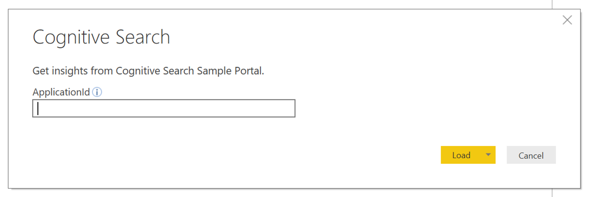
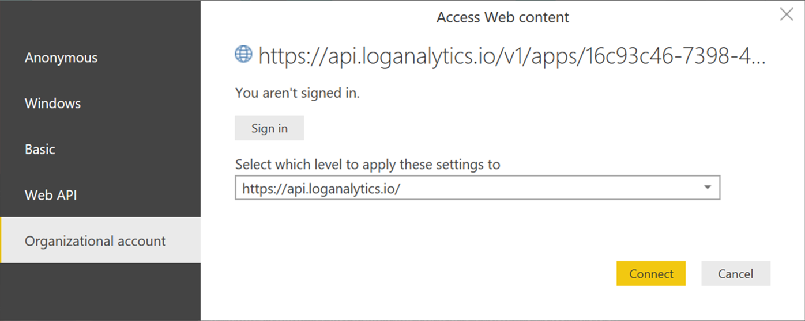

# Reporting

A PowerBI Template file has been created so you can quickly spin up reports based on the Cognitive Search Template UI. To create the reports, simply open **Cognitive Search.pbit** using PowerBI Desktop.

## Prerequisites

1. Application Insights is used to capture the telemetry data for these reports.  If you chose to not provision Application Insights and update the *InstrumentationKey* in the web app's *appsettings.json* file, you will not have data available to run the reports in this repository.
2. PowerBI Desktop installed on your computer

## Getting Started

When you open the template, you will be asked for your **Application Insights Application ID**. This Application ID can be found by going to the Azure portal -> navigating to the App Insights resource -> then clicking on API Access:

After you enter the Application Id, click **Load**. 

<!--  -->

Next, it will ask for credentials:

<!--  -->

Enter your credentials and you'll have PowerBI reports ready to go like the one seen below:

<!--  -->

## Additional Materials
For more information on PowerBI and developing reports on PowerBI see [What is Power BI](https://docs.microsoft.com/en-us/power-bi/power-bi-overview).

## Special Thanks 
Special thanks to Emilio D'Angelo for creating this PBI template. 